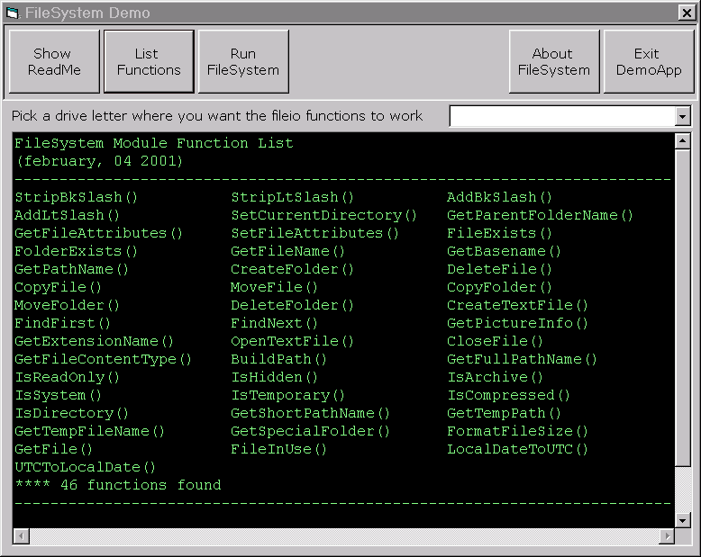



## FileSystem module

### Description

BAS Module that handle several FileSystemObject methods using Windows API calls. Several new functions were added. This module will make file/folders operations a breeze.
 
### More Info
 
This module uses API calls, so you may face problems concerning platform specific issues

             |
---                |---
**Submitted On**   |2001-02-04 12:21:50
**By**             |[Marclei V Silva](https://github.com/Planet-Source-Code/PSCIndex/blob/master/ByAuthor/marclei-v-silva.md)
**Level**          |Intermediate
**User Rating**    |4.8 (19 globes from 4 users)
**Compatibility**  |VB 5\.0, VB 6\.0
**Category**       |[Files/ File Controls/ Input/ Output](https://github.com/Planet-Source-Code/PSCIndex/blob/master/ByCategory/files-file-controls-input-output__1-3.md)
**World**          |[Visual Basic](https://github.com/Planet-Source-Code/PSCIndex/blob/master/ByWorld/visual-basic.md)
**Archive File**   |[CODE\_UPLOAD14521242001\.zip](https://github.com/Planet-Source-Code/marclei-v-silva-filesystem-module__1-15002/archive/master.zip)

### API Declarations

Many but don't be afraid

